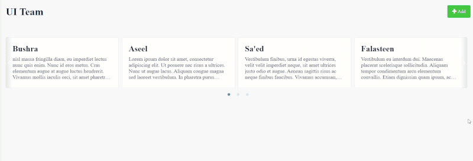
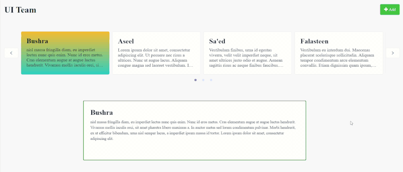
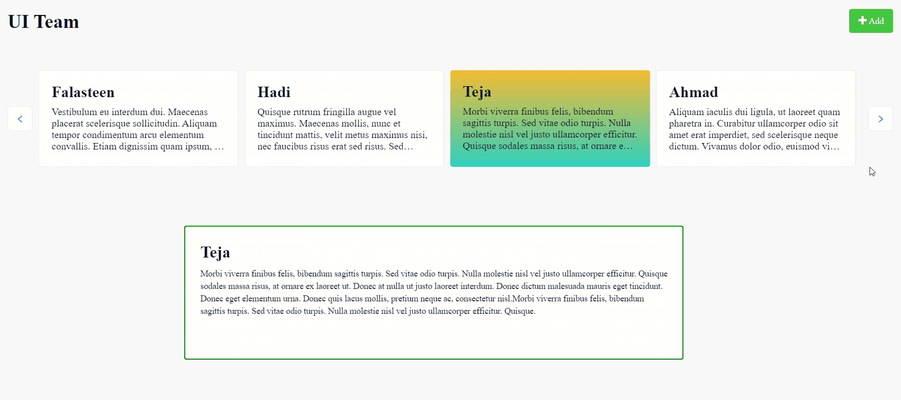

## Multi Carousel / Slider

Multi Carousel widget is a web widget for building ***static*** and ***dynamic*** content rotators. also it could be used as a **Slider**.

## Features

* Static or dynamic content.
* Support adding action and auto active item.
* Auto Play.
* Stop/Pause buttons.
* Infinite loop.
* Change loop direction.
* Swipe to card.
* Touch and Drag support.
* Stretch/unstretch the items to fill the available space.
* Auto Height and Width.
* Responsive design.
* Styled control buttons.

## Usage

### 1. Carousel type:

* **Normal Carousel**: content rotators without an active card or built-in action support. However, you can add actions to the card manually from the content.

    
  
* **Carousel with Active Card**: content rotators with active card and action support. the card will set active and its action will be fired on click the card.
    > ***Note***: adding an action to the **cards content** (from Mendix properties) will override the method that handles setting the active card.

    

### 1. Slider

Only support for Dynamic data type, allow users to slide the items using "left/right" buttons. the active card will be auto set, and it's action will be auto fired.



## Issues, suggestions

1. The static data type doesn't support adding a built-in action, you can use the active carousel or the slider with a static data by turn it to a dynamic content.
 
2. Adding an action to the cards content in ***Carousel with Active Card*** type will override the method that handles setting the active card. if you wish to do that, use the ***Normal Carousel***.
 
3. Every carousel has an auto generated unique class name starting with "-a". You can use it in case you have multiple carousel in the same page.

4. For **Carousel with Active Card** and the **Slider**, the widget will automatically slide to the first item, active it and fire its action.
## Development and contribution

```
    $ cd [cloned widget folder]
    $ npm install
    $ npm run build
    <!-- will bundle the project in root level for this project, in a widget folder -->

    <!-- node version 16.17.1 -->
```

## UI (CSS classes)

**1- Common classes:**
```
// Extra Items
.multi-carousel__extra-item

// Loading
.multi-carousel__loading

// Error
.multi-carousel__error

<!--  From alice carousel package classes -->

// buttons style
.alice-carousel__prev-btn
.alice-carousel__prev-btn-item

// Dots
.alice-carousel__dots
.alice-carousel__dots-item

// Auto play buttons
.alice-carousel__play-btn
.alice-carousel__play-btn-item
```

**2- Normal carousel:**
```
.normal-carousel__container
.normal-carousel__item

// The pre-styled buttons parent container
.normal-carousel__styled-btn
```
**2- Carousel with Active Card:**
```
.active-click-carousel__container
.active-click-carousel__item

// The pre-styled buttons parent container
.active-click-carousel__styled-btn
```
**4- Slider:**
```
.active-slide-carousel__container

.active-slide-carousel__wrapper

.active-slide-carousel__prev-btn
.active-slide-carousel__next-btn
```

***************
 LinkedIn [Aseel Dweedar](https://www.linkedin.com/in/aseel-dweedar)