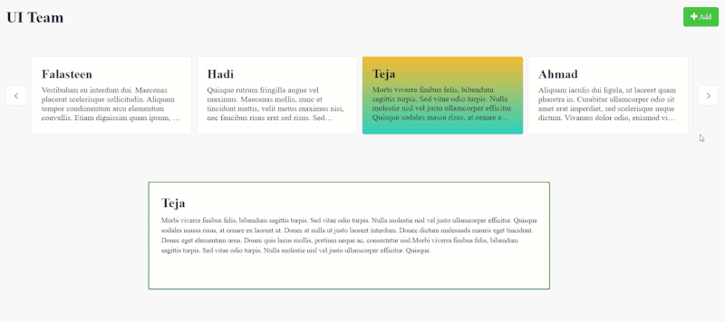

## MultiCarousel

Multi Carousel widget is a web widget for building ***dynamic*** content rotators. built based on "react-alice-carousel" library.

Please visit [React Alice Carousel](https://www.npmjs.com/package/react-alice-carousel) for more information.

## Features

* dynamic content
* Support action for the slides
* Custom animation modes
* Auto Height
* Auto Width
* Mobile friendly
* Responsive design

    **For normal and active on click types**
    * Auto Play
    * Infinite loop
    * Swipe to slide
    * Touch and Drag support

## Usage

This widget works as ***list view*** to display the ***dynamic*** data as a carousel. contains 3 types:

* **Normal carousel**: content rotators without a built-in action support. However, you can add actions to the slides in the content.

    
  
* **Active on click carousel**: content rotators with active slide. you can set the active slide and fire it's action on click the slide.
    > ***Note***: adding an action to the slides content in this type will override the method that handles setting the active slide.

    

* **Active on slide carousel**: content rotators with active slide. switching the active slide happens automatically when clicking next/prev buttons.

    

## Issues, suggestions
1. This widget built only to handle **dynamic** data only.
 
2. Adding an action to the slides content in ***active on click*** type will override the method that handles setting the active slide. if you wish to do that, use the ***Normal type***.
 
3. Every carousel has an auto generated unique class name starting with "-a". You can use it in case you have multiple carousel in the same page.

## Development and contribution

```
    $ cd [cloned widget folder]
    $ npm install
    $ npm run build
    <!-- will bundle the project in root level for this project, in a widget folder -->

    <!-- node version 16.17.1 -->
```

## UI (CSS classes)


**1- Normal carousel:**
```
.normal-carousel__container
.normal-carousel__item

<!-- For Buttons style use alice carousel package classes -->

    .alice-carousel__prev-btn
    .alice-carousel__prev-btn-item

    .alice-carousel__next-btn
    .alice-carousel__next-btn-item
```
**2- Active on click carousel:**
```
.active-click-carousel__container
.active-click-carousel__item

<!-- For Buttons style use alice carousel package classes -->

    .alice-carousel__prev-btn
    .alice-carousel__prev-btn-item

    .alice-carousel__next-btn
    .alice-carousel__next-btn-item
```
**3- Active on slide carousel:**
```
.active-slide-carousel__container

.active-slide-carousel__wrapper

.active-slide-carousel__prev-btn
.active-slide-carousel__next-btn
```
**4- Dots:**
```
<!-- From alice carousel package classes -->

    .alice-carousel__dots
    .alice-carousel__dots-item
```
**5- Auto play buttons:**
```
<!-- From alice carousel package classes -->

    .alice-carousel__play-btn
    .alice-carousel__play-btn-item
```